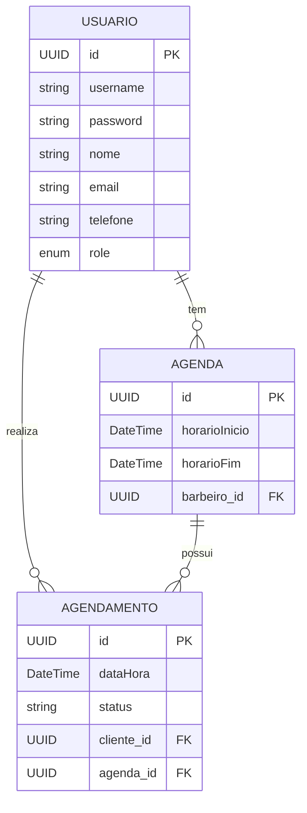

```mermaid
erDiagram
    USUARIO ||--o{ AGENDA : "tem"
    USUARIO ||--o{ AGENDAMENTO : "realiza"
    AGENDA ||--o{ AGENDAMENTO : "possui"

    USUARIO {
        UUID id PK
        string username
        string password
        string nome
        string email
        string telefone
        enum role
    }

    AGENDA {
        UUID id PK
        DateTime horarioInicio
        DateTime horarioFim
        UUID barbeiro_id FK
    }

    AGENDAMENTO {
        UUID id PK
        DateTime dataHora
        string status
        UUID cliente_id FK
        UUID agenda_id FK
    }
```