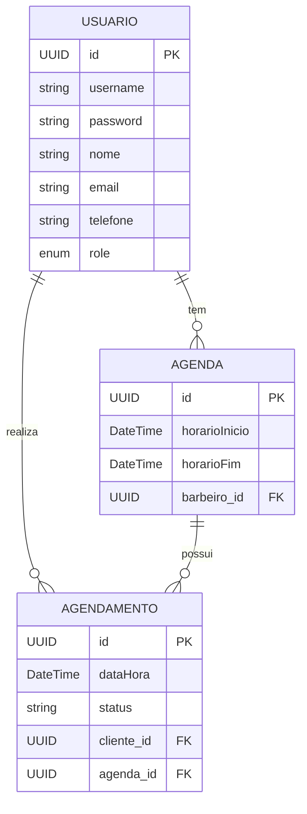

 ✂️ Barber API + Frontend Angular

Este projeto é uma aplicação full stack para gerenciamento de agendamentos em uma barbearia. A API foi desenvolvida em **Java** com **Spring Boot**, e o frontend em **Angular** com **Angular Material**.

---

## 🛠️ Tecnologias Utilizadas

### Backend
- Java 17+
- Spring Boot
- Swagger (Documentação)
- PostgreSQL (via Docker)
- Maven

### Frontend
- Angular 16+
- Angular Material
- TypeScript
- SCSS

---

## 📦 Pré-requisitos

- Docker e Docker Compose
- Java 17 ou superior
- Node.js e Angular CLI (`npm install -g @angular/cli`)

---

## ⚙️ Instruções para Subir o Projeto

### 1. Subir o Banco de Dados PostgreSQL com Docker

```bash
docker compose up -d
```

### 2. Iniciar o Backend (Spring Boot)
 - Navegue até a pasta do backend e execute:

```bash
cd api
./mvnw spring-boot:run
```

###3. Iniciar o Frontend (Angular)
 - Navegue até a pasta do frontend, instale as dependências e inicie o servidor de desenvolvimento:

```bash

cd barbershop-client
npm install
ng serve
```
### O frontend estará disponível em: http://localhost:4200
  

## Acessar o Swagger
[Acesse o Swagger](http://localhost:8080/swagger-ui/index.html#/)



