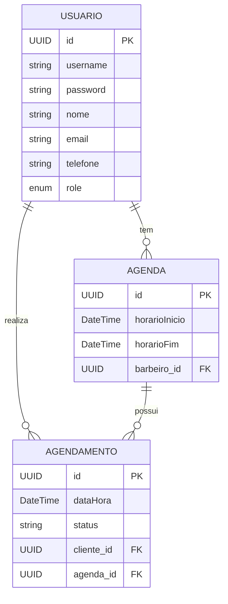

# Barber API

Este projeto é uma API desenvolvida em Java para gerenciamento de agendamentos em uma barbearia.

## Pré-requisitos

- Docker
- Java 17+
- Maven

## Instruções para subir o projeto

1. **Subir o banco de dados PostgreSQL com Docker:**
    # docker compose up -d

## Acessar o Swagger
[Acesse o Swagger](http://localhost:8080/swagger-ui/index.html#/)

